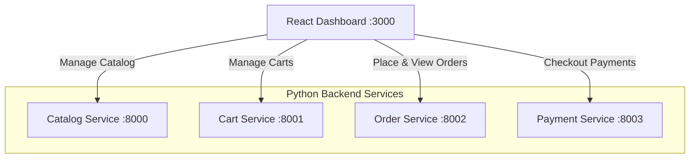

# 🛍️ E-Commerce Microservices System

[](https://fastapi.tiangolo.com)
[](https://reactjs.org)
[](https://www.docker.com)
[](https://kubernetes.io)
[](https://www.python.org)

A modern, containerized e-commerce backend and administrative frontend. The project utilizes a microservices architecture built with **FastAPI** (Python), **React** (frontend), containerized with **Docker**, and prepared for orchestrating on **Kubernetes** clusters.

---

## 🏗️ Architecture Overview

The system is split into four autonomous backend services and a central administrative dashboard. Each service runs independently and communicates via HTTP REST APIs.



---

## 📁 System Components & Services

| Service | Port | Technology | Primary Purpose | Database (Current) |
| :--- | :--- | :--- | :--- | :--- |
| **Catalog Service** | `8000` | FastAPI | Handles product listing, creation, and inventory updates | In-Memory |
| **Cart Service** | `8001` | FastAPI | Manages user shopping carts (add, retrieve, remove items) | In-Memory |
| **Order Service** | `8002` | FastAPI | Manages order creation, lifecycle states, and order details | In-Memory |
| **Payment Service** | `8003` | FastAPI | Handles fake payment authorization and checkout processing | In-Memory |
| **Order Dashboard** | `3000` | React | Administrative UI visualizing catalog, orders, and statuses | Frontend client |

---

## 🚀 Getting Started & Running

You can spin up the entire ecosystem using the automated launch scripts.

### Option A: The Docker Way (Recommended)
This compiles all containers and connects them inside a unified Docker network.
1. Make sure **Docker Desktop** is open and running.
2. Double-click the helper script:
   - 📦 Windows: Double-click [start.bat](file:///e:/Projects/E-commerce/start.bat) or run `./start_with_docker.ps1` in PowerShell.
   - 🐧 Linux/macOS: Run `docker-compose up --build` in your terminal.

---

### Option B: Local PowerShell Orchestration
Run the backend and dashboard processes directly on your host machine in separate shell windows:
```powershell
./start_dev.ps1
```

---

### Option C: Manual Setup
If you wish to run services manually, follow the setups below:

#### 1. Backend Python Services (Ports 8000–8003)
Run this for each directory under the `services/` directory:
```bash
# Example for Catalog Service
cd services/catalog-service
pip install -r requirements.txt
uvicorn main:app --reload --port 8000
```
Repeat for:
- `services/cart-service` (Port `8001`)
- `services/order-service` (Port `8002`)
- `services/payment-service` (Port `8003`)

#### 2. Frontend React Dashboard (Port 3000)
```bash
cd dashboard/order-dashboard
npm install
npm start
```

---

## 📘 Interactive API Swagger Documentation

Since each backend service is powered by FastAPI, you can access an interactive **Swagger UI** for testing endpoints directly in your browser:

- 📖 **Catalog API Docs:** [http://localhost:8000/docs](http://localhost:8000/docs)
- 📖 **Cart API Docs:** [http://localhost:8001/docs](http://localhost:8001/docs)
- 📖 **Order API Docs:** [http://localhost:8002/docs](http://localhost:8002/docs)
- 📖 **Payment API Docs:** [http://localhost:8003/docs](http://localhost:8003/docs)

---

## ⚡ API Quick Examples

### Create a New Product (Catalog Service)
```bash
curl -X POST "http://localhost:8000/products" \
  -H "Content-Type: application/json" \
  -d '{
    "name": "Mechanical Keyboard",
    "price": 89.99,
    "stock": 15
  }'
```

### Place an Order (Order Service)
```bash
curl -X POST "http://localhost:8002/orders" \
  -H "Content-Type: application/json" \
  -d '{
    "user_id": "user123",
    "items": [
      {
        "product_id": "prod-abc-123",
        "quantity": 1
      }
    ]
  }'
```

---

## ⛵ Kubernetes Deployment (k8s)

Deployment manifests for all services are located inside the `k8s/` folder. They can be deployed to a local Kubernetes cluster (like KinD or Minikube):
```bash
kubectl apply -f k8s/
```
